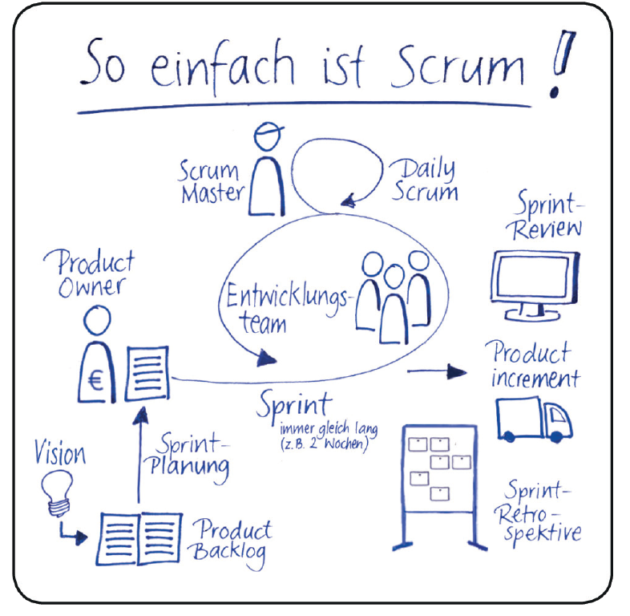

# Übung 1 – Prozessmodelle und Datenbewirtschaftung

## Lernziel

1. Sie können die Prinzipien des Software Engineering in klassischen und in agilen Projekten nennen und in Beziehung setzen.
2. Sie können die Datenbewirtschaftung am Beispiel des Vorgehensmodells CRISP DM erklären und anwenden.

## Aufgabe 1: Prozessmodelle (10 Punkte)

Scrum als agiles und iteratives Prozessmodell im Kontext eines Data Science Projekts.

| Wer oder was | Information | Details |  |
| --- | --- | --- | --- |
| Product Owner (PO) | Matthias Mruzek-Vering | mrma0001@h-ka.de |
| Scrum Master (SM) | Raphaele Licciardo _Hält während der Sprints externe Störungen vom Entwicklungsteam fern und löst auftretende Probleme, die nicht die Entwicklung betreffen, zeitnah._ | lira1011@h-ka.de |
| Entwickler | Siehe `E1_2021ss_Gruppe.docx` Seite 1 Kopfzeile | https://github.com/orgs/hka-mmv/teams/dscb230-students |
| Projekt Kickoff | Montag, 31.05.2021, 14:00 Uhr |  |
| Sprint Meeting 1 | Montag, 07.06.2021, 14:00 Uhr |  |
| Sprint Meeting 2 | Montag, 14.06.2021, 14:00 Uhr |  |
| Ergebnispräsentation | Dienstag, 22.06.2021, 9:50 Uhr | Gruppe b |
| Ergebnispräsentation | Freitag, 25.06.2021, 9:50 Uhr | Gruppe a |
| Product Backlog | Gesamte Anforderungen an die Datenauswertung werden im Product Backlog festgehalten, in das der PO jederzeit Ideen für neue Anforderungen eintragen kann. | GitHub Projekt [2021-summerterm](https://github.com/orgs/hka-mmv/projects/2) via [GitHub Issues](https://github.com/hka-mmv/dscb230-exercise/issues) mit Label `requirement` |
| Sprint Meeting | Besprechung der Anforderungen, die tatsächlich im nächsten Sprint umgesetzt werden sollen. Festgelegt durch PO. Die Entwickler bestimmen, wie viele dieser Anforderungen im Sprint möglich sind. | Sprint Backlog |
| Sprint Backlog | Die Anforderungen für den nächsten Sprint. Änderungen am Sprint Backlog während des Sprints sind nicht erlaubt. | Sprint Backlog |
| Spint | Entwickler arbeiten autonom alle Anforderungen, die für den Sprint vorgesehen sind. |  |
| Daily Scrum | Meeting der Entwickler mit SM für max. 15 min. Inhalt: Reflektieren über die Arbeit des letzten Tages und planen den kommenden Arbeitstag.  Leitfragen: 1. Was habe ich seit dem letzten Daily Scrum erledigt? 2. Was hat mich dabei behindert? 3. Was werde ich bis zum nächsten Daily Scrum tun? | Wann: Täglich zur gleichen Zeit In unserem Fall findet dies an den Tagen Freitag im Tutorium via Zoom Meeting in Breakout-Rooms statt. |
| Sprint Review | Entwickler präsentieren dem PO die Zwischenergebnisse, um Feedback zu bekommen. Teile des Feedbacks werden zu neuen Einträgen im Product Backlog. | Wann: Am Ende jedes Sprints. In unserem Fall findet dies im Sprint Meeting statt. Präsentiert werden die Inhalte im GitHub Gruppenverzeichnis. |
| Sprint Retrospective | Scrum Team reflektiert den Entwicklungsprozess, um diesen für die Zukunft zu verbessern Artefakte: GitHub Gruppenverzeichnis, Dateiname | Wann: Am Ende jedes Sprints. In unserem Fall findet dies im Sprint Meeting statt. Präsentiert werden die Inhalte im GitHub Gruppenverzeichnis. |

### Aufgabenstellung

1. Bitte lesen Sie sich in das Thema ein und machen sich damit vertraut.
2. Bitte folgenden Sie den Hinweisen im Dokument `E1_2021ss_Gruppe.docx`.
3. Bitte richten Sie die Kommunikationswege mit den Projektbeteiligten ein, z. B. E-Mail-Adressen, Chat/Messanger-Gruppe, Zoom Link etc.
4. Bitte senden Sie, falls noch nicht geschehen, Ihren GitHub Username und Teamname an den Scrum Master, damit Sie in ein GitHub Team aufgenommen werden können. Siehe Teams
5. Bitte organisieren Sie Ihre Entwicklungswerkzeuge insbesondere den reibungslosen Upload in Ihr GitHub Repo.
6. Bitte erstellen Sie benötigte Dokumente in Ihrem GitHub Repo im entsprechendem Gruppenverzeichnis in `e1`.  
   a. Gruppenverzeichnis erstellen, falls noch nicht gemacht  
   b. Erstellen Sie eine `Readme.md` Datei, in der Sie Ihre Teammitglieder auflisten.

   > Leere Verzeichnisse verschwinden in GitHub, deshalb entweder eine Dummy-Datei anlegen oder die leere Datei `.gitkeep`.

## Aufgabe 2: Datenbewirtschaftung (15 Punkte)

Datenanalyse am Beispiel Airbnb New York unter Verwendung der Methode CRISP-DM

### Quellen

- Vorlesung `DSCB230_MMV_1_Grundlagen.pdf`
- https://www.datascience-pm.com/crisp-dm-2/
- https://datadrivencompany.de/crisp-dm-das-modell-einfach-erklaert-und-visualisiert/
- https://www.kaggle.com/faressayah/analysis-of-airbnb-data-new-york-city

### Aufgabenstellung

1. Bitte lesen Sie sich in das Thema ein und machen sich damit vertraut.
2. Bitte erheben Sie die benötigten Informationen, die mit **TODO** gekennzeichnet sind und tragen Sie diese im Dokument `E1_2021ss_Gruppe.docx` zusammen.
3. Bitte lesen und verfolgen Sie die Projekt-Dokumentation in [GitHub Issues](https://github.com/hka-mmv/dscb230-exercise/issues).

| Thema | Inhalt | Detail |
| --- | --- | --- |
| Geschäftsverständnis **BUSINESS UNDERSTANDING**  _Anforderungen und Rahmenbedingungen von PO an die Datenanalyse_ | - Hosts, Art der Unterkunft, Stadtteile - Geografische Analyse in Form einer HeatMap - Günstigster Preis auf Landkarte farblich anzeigen - Weitere Analyseziele z.B. Verknüpfung mit anderem Datensatz wie Kriminalstatistik (JOIN via Neighborhood) | [GitHub Issues](https://github.com/hka-mmv/dscb230-exercise/issues) mit Label `requirement` |
| Datenverständnis **DATA UNDERSTANDING**  _Skizzierung und Sichtung der benötigten Daten Auswahl von Werkzeugen und Anforderungen an Formate_ | **TODO** - Datenquellen - Metadaten - Datentypen - Speicherort | **TODO** Inhalte ausarbeiten |
| Datenvorbereitung **DATA PREPARATION**  _Konstruktion einer grundlegenden Population_ | - Metadaten der Datenquelle erfassen - Auswahl relevanter Daten - Daten organisieren und ggf. in Data Sets aufteilen - Daten bereinigen | Scrum Team untersucht die Datenquelle und macht PO Vorschläge der relevanten Daten mit Begründung.  Data Sets je nach Analysekontext |
| Modellierung **MODELING**  _Konzeption eines Modells, das die Anforderungen maximal erfüllt_ | _Normalerweise wird diese Method angewandt. Für unsere Übung ist es allerdings nicht passend, deshalb lassen wir dies weg._ |  |
| Analyse und Interpretation **EVALUATION & DEPLOYMENT**  _Aufbereitung und Präsentation der Ergebnisse_ | **TODO** Aufbereitung der Data Preparation zu jedem Sprint Meeting.  Die Abschlusspräsentation wird in der Projektarbeit bearbeitet. | Siehe **Übung 3**: Optionale Unit Tests in GitHub Verzeichnis `e3`  Deployment der Abschlusspräsentation in GitHub Verzeichnis `p` |

## Legende zur Bezeichnung der Backlog Items bzw. Issues

| Thema                  | Abkürzung | Beispiel                         |
| ---------------------- | :-------: | -------------------------------- |
| Business Unterstanding |    BU     | 1-BU_GRUPPE_E1_Issue_Description |
| Data Understanding     |    DU     | 2-DU_GRUPPE_E1_Issue_Description |
| Data Preparation       |    DP     | 3-DP_GRUPPE_E1_Issue_Description |
| Modeling               |    MD     | 4-MD_GRUPPE_E1_Issue_Description |
| Evaluation             |    EV     | 5-EV_GRUPPE_E1_Issue_Description |
| Deployment             |    DT     | 6-DT_GRUPPE_E1_Issue_Description |
